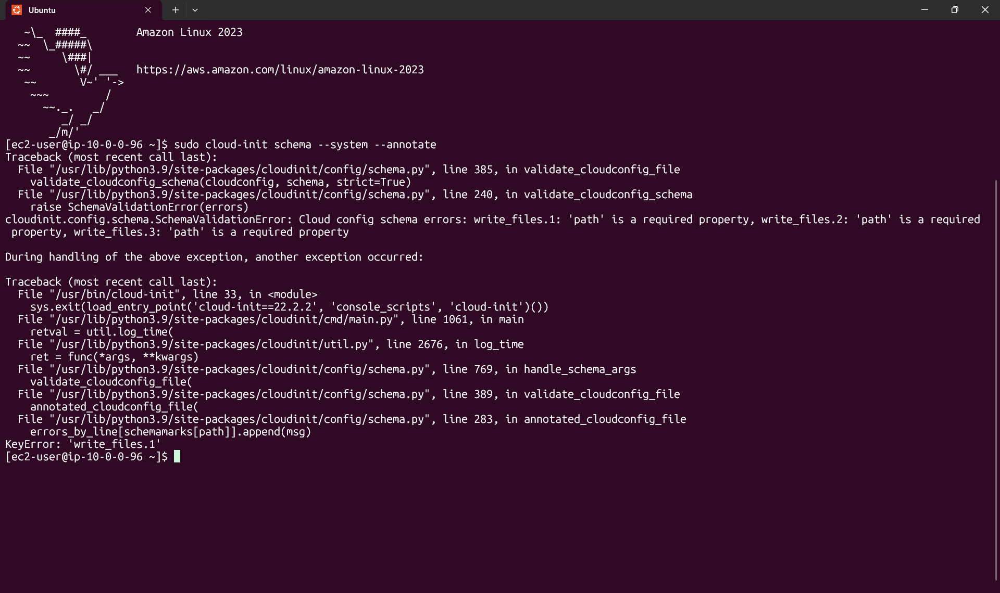
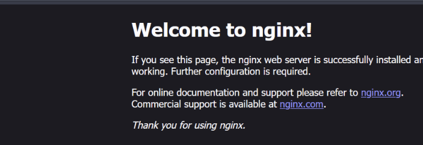

# Assignment 2 – EC2 Deployment with Cloud-Init

Automated deployment of an NGINX web server on AWS EC2. Terraform creates the infrastructure, and a cloud-init file configures the server on first boot. When the instance comes up, the website is already live with **no manual steps**.


---

## Assignment requirements

**Objective:** Configure a cloud-init file and use Terraform to automate an EC2 deployment.

**Tasks**

- [x] Write a cloud-init YAML file
- [x] Install and configure software on boot (NGINX)
- [x] Pass cloud-init to the EC2 instance through Terraform
- [x] Ensure the instance comes online fully configured with no manual steps

**What should be demonstrated**

- How Terraform uses `user_data` or `user_data_base64`
- How cloud-init automates instance configuration
- How to structure Terraform for clarity (variables, outputs, modules if needed)

---

## Repository structure

```
.
├── main.tf            # provider, security group, EC2 instance
├── variables.tf       # region, instance type, AMI, etc.
├── outputs.tf         # public IP and website URL
├── cloud-init.yaml    # server configuration applied on first boot
├── screenshots-asg2/  # validation error, nginx default page, final result
└── README.md
```

---

## How it works

```
terraform apply
      │
      ▼
Terraform creates the EC2 instance and passes cloud-init.yaml as user_data
      │
      ▼
Instance boots → cloud-init reads the user data
      │
      ├─ package_update / packages   → updates package list, installs nginx
      ├─ write_files (defer: true)   → writes index.html + nginx site config
      └─ runcmd                      → checks config, enables and restarts nginx
      │
      ▼
Website is live at http://<public-ip>
```

---

## The cloud-init file

```yaml
#cloud-config
package_update: true
packages:
  - nginx

write_files:
  - path: /var/www/Website/index.html
    permissions: '0644'
    defer: true
    content: |
      <html>
        <head>
          <title>Welcome to My Website</title>
        </head>
        <body>
          <h1>Hello, World!</h1>
          <p>Hosted on an EC2 instance in nginx webserver.</p>
        </body>
      </html>

  - path: /etc/nginx/conf.d/site.conf
    permissions: '0644'
    defer: true
    content: |
      server {
          listen 80 default_server;
          listen [::]:80 default_server;

          server_name _;

          root /var/www/Website;
          index index.html;

          location / {
              try_files $uri $uri/ =404;
          }
      }

runcmd:
  - nginx -t
  - systemctl enable nginx
  - systemctl restart nginx
```

### What each part does

| Key | Module | Purpose |
|---|---|---|
| `package_update` | Package Update Upgrade Install | Refreshes the package list (`dnf`) before installing |
| `packages` | Package Update Upgrade Install | Installs nginx. cloud-init picks the right package manager for the distro |
| `write_files` | Write Files | Creates the web page and the nginx site config. Parent folders are created automatically |
| `defer: true` | Write Files | Writes the files **after** packages are installed, so nginx's install doesn't interfere |
| `permissions: '0644'` | Write Files | Readable by the `nginx` user, writable only by root |
| `runcmd` | Runcmd | Runs as root on first boot: validates the nginx config, enables and starts nginx |

### Notes on the nginx config

- **`/etc/nginx/conf.d/`** is where Amazon Linux loads extra sites from (Ubuntu uses `sites-enabled/` instead).
- **`default_server`** makes this site the one nginx uses when the request's host name (here, the bare IP) doesn't match any `server_name`. Without it, the built-in default site in `nginx.conf` answers instead.
- **`server_name _;`** is the convention for "no specific domain".

---

## Terraform: passing cloud-init to EC2

> Adjust names below to match the `.tf` files in this repo.

### `user_data` vs `user_data_base64`

| Argument | Use when |
|---|---|
| `user_data` | You pass **plain text** (like a YAML file). The AWS provider base64-encodes it for you. Used in this project. |
| `user_data_base64` | The data is **already base64-encoded**, e.g. gzipped or multi-part output from the `cloudinit_config` data source. |

### `main.tf` (core parts)

```hcl
resource "aws_security_group" "web" {
  name        = "web-sg"
  description = "Allow HTTP and SSH"

  ingress {
    from_port   = 80
    to_port     = 80
    protocol    = "tcp"
    cidr_blocks = ["0.0.0.0/0"]
  }

  ingress {
    from_port   = 22
    to_port     = 22
    protocol    = "tcp"
    cidr_blocks = [var.my_ip_cidr]
  }

  egress {
    from_port   = 0
    to_port     = 0
    protocol    = "-1"
    cidr_blocks = ["0.0.0.0/0"]
  }
}

resource "aws_instance" "web" {
  ami                    = var.ami_id
  instance_type          = var.instance_type
  key_name               = var.key_name
  vpc_security_group_ids = [aws_security_group.web.id]

  user_data                   = file("${path.module}/cloud-init.yaml")
  user_data_replace_on_change = true

  tags = {
    Name = "cloud-init-nginx"
  }
}
```

`user_data_replace_on_change = true` matters: most cloud-init modules run **once per instance**, so editing the YAML on an existing instance does nothing. This setting makes Terraform replace the instance when the cloud-init file changes, so the new config actually runs.

### `variables.tf`

```hcl
variable "region"        { default = "eu-north-1" }
variable "instance_type" { default = "t3.micro" }
variable "ami_id"        { description = "Amazon Linux 2023 AMI ID" }
variable "key_name"      { description = "EC2 key pair for SSH" }
variable "my_ip_cidr"    { description = "Your IP for SSH, e.g. 1.2.3.4/32" }
```

### `outputs.tf`

```hcl
output "public_ip" {
  value = aws_instance.web.public_ip
}

output "website_url" {
  value = "http://${aws_instance.web.public_ip}"
}
```

### Deploy

```bash
terraform init
terraform plan
terraform apply
```

Open the `website_url` output in a browser. Allow a minute after the instance starts for cloud-init to finish.

---

## Validating the cloud-config

cloud-init ships with a schema validator that checks the YAML against the rules for every module (required keys, value types, allowed options).

```bash
# Before deploying, on any machine with cloud-init installed
cloud-init schema --config-file cloud-init.yaml

# On a running instance, check the user data it booted with
sudo cloud-init schema --system
```

A valid file prints `Valid cloud-config`.

> **Note:** On Amazon Linux 2023 (cloud-init 22.2.2) the `--annotate` flag crashes with a Python `KeyError` when the config has errors. Run without `--annotate` to see the error list.

---

## Trial and error

The final config took several iterations. Each mistake taught something about YAML or cloud-init.

### 1. `'path' is a required property`

```
write_files.1: 'path' is a required property,
write_files.2: 'path' is a required property,
write_files.3: 'path' is a required property
```



**Cause:** I put a dash (`-`) in front of every key in a file entry. In YAML a dash starts a **new list item**, so cloud-init saw several "files" without a path.

```yaml
# Wrong: 3 entries
- path: /etc/nginx/conf.d/site.conf
- content: ...
- permissions: '0644'

# Right: 1 entry with 3 keys
- path: /etc/nginx/conf.d/site.conf
  content: ...
  permissions: '0644'
```

**Lesson:** one dash per file. In `packages` and `runcmd` every line gets a dash because each item is a single value; in `write_files` each item is an object with several keys.

### 2. `write_files:` written twice

I started a new `write_files:` block for the second file. A YAML key can only appear once, so the second block **silently replaced** the first and `index.html` was never written. Fix: put both files under one `write_files:`.

### 3. Indentation mistakes

- Keys at column 0 (`content:` not lined up under `path:`) no longer belong to the file entry. The schema check still passes because the entry has a `path`, but the file ends up empty.
- Keys indented as far as the text under `content: |` become **part of the file's content**.
- Without `|` after `content:`, YAML joins all lines into one.

**Lesson:** every key belonging to a file must start in the same column as `path`.

### 4. Invalid nginx config

`server_name;` with no value is invalid in nginx and stops it from starting. Fixed with `server_name _;`. I also added `nginx -t` to `runcmd` so nginx config errors show up in the cloud-init log.

### 5. nginx showed its default page instead of my site

Validation passed and nginx was running, but the browser showed **"Welcome to nginx!"**.



**Cause:** Amazon Linux's `nginx.conf` already contains a default site on port 80. I was visiting the bare IP, which matched neither site's `server_name`, so nginx used its fallback site, the built-in one.

**Clue in the logs:** in `/var/log/nginx/access.log`, the 404 for `/favicon.ico` was 3464 bytes, the size of the built-in site's styled `404.html`. My site would have returned nginx's small plain 404, so the requests were going to the wrong site.

**Fix:** add `default_server` to my `listen` lines. After that, the browser showed my **Hello, World!** page, all configured automatically by cloud-init:


**Related lesson:** the nginx config came from Ubuntu's official tutorial, which uses port 81 to avoid exactly this clash and a different folder layout (`sites-enabled/`). Official examples assume their own distro.

---

## Debugging steps

| What to check | Command |
|---|---|
| Did cloud-init finish, and with errors? | `cloud-init status --long` |
| Output of package installs and `runcmd` | `sudo cat /var/log/cloud-init-output.log` |
| Detailed cloud-init log (module by module) | `sudo less /var/log/cloud-init.log` |
| The user data the instance actually received | `sudo cat /var/lib/cloud/instance/user-data.txt` |
| Validate the received config | `sudo cloud-init schema --system` |
| Were the files written? | `ls -l /var/www/Website/ /etc/nginx/conf.d/` |
| Is the nginx config valid? | `sudo nginx -t` |
| What nginx actually loaded | `sudo nginx -T \| grep -E "listen\|server_name\|root"` |
| What the server returns locally | `curl localhost` |
| Requests and errors | `/var/log/nginx/access.log`, `/var/log/nginx/error.log` |

If `curl localhost` shows the page but the browser doesn't, the problem is outside the server: security group, `http://` vs `https://`, or the wrong IP.

---

## Why cloud-config instead of a plain user-data script

User data can also be a bash script (`#!/bin/bash`). This project uses `#cloud-config` instead, and it turned out to be much smoother:

- **Modules do the work for you.** Each key (`packages`, `write_files`, `runcmd`, `users`, `timezone`…) is handled by a module that knows how to do that job properly. No need to write the logic for creating folders, setting permissions or decoding content.
- **Tasks and configuration are separated.** Installing software, writing files and running commands are clearly separate sections, instead of one long script mixing everything.
- **Distro-independent.** `packages:` uses `dnf` on Amazon Linux and `apt` on Ubuntu, with the same YAML.
- **Ordering is handled.** Modules run in defined boot stages, and `defer: true` lets files be written after packages are installed.
- **Built-in validation.** `cloud-init schema` catches mistakes like missing required keys before or after deploying. A bash script just fails at runtime.
- **Clear logging.** Everything is logged to `/var/log/cloud-init.log` and `cloud-init-output.log`, with module names, making it easy to see what ran and what failed.
- **Documentation and support.** The official module reference lists every module, its keys, supported distros, how often it runs and examples, and cloud-init is the standard on all major clouds.

---

## Key takeaways

- A **dash** starts a new list item; **indentation** decides what belongs to what.
- Most cloud-init modules run **once per instance**. To apply a changed config, launch a new instance (`user_data_replace_on_change` in Terraform).
- **Validate** with `cloud-init schema` before and after deploying.
- A valid cloud-config can still produce a broken service. Check the **service itself** too (`nginx -t`, `curl localhost`, logs).
- Tutorials are written for a specific distro; adapt paths and defaults to the one you're using.

---

## Sources

- [cloud-init module reference](https://docs.cloud-init.io/en/latest/reference/modules.html)
- [cloud-init configuration priority / user data formats](https://docs.cloud-init.io/en/latest/explanation/format/index.html)
- [Terraform `aws_instance` resource](https://registry.terraform.io/providers/hashicorp/aws/latest/docs/resources/instance)
- [nginx `server_name` and `default_server`](https://nginx.org/en/docs/http/request_processing.html)
