# Automated WordPress Deployment on AWS with Terraform

One `terraform apply` builds a complete network and web server on AWS and installs a working WordPress site on it, with no clicking in the AWS console and no manual SSH setup.

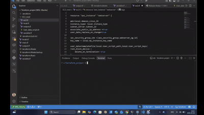

**Tech:** Terraform · AWS (VPC, Subnet, Internet Gateway, Route Table, Security Groups, EC2) · Amazon Linux 2023 · Bash · cloud-init · Apache · PHP · MariaDB · WordPress

## The result

`terraform apply` finishes and prints the server's public IP:

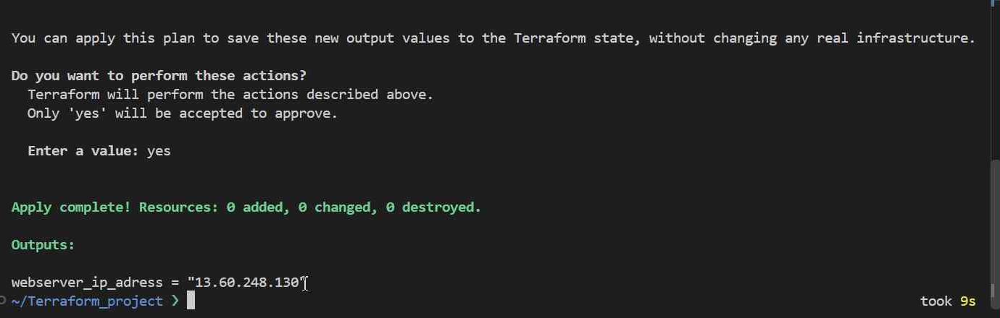

Opening that IP shows the live WordPress site running on EC2, with a link back to this repo:

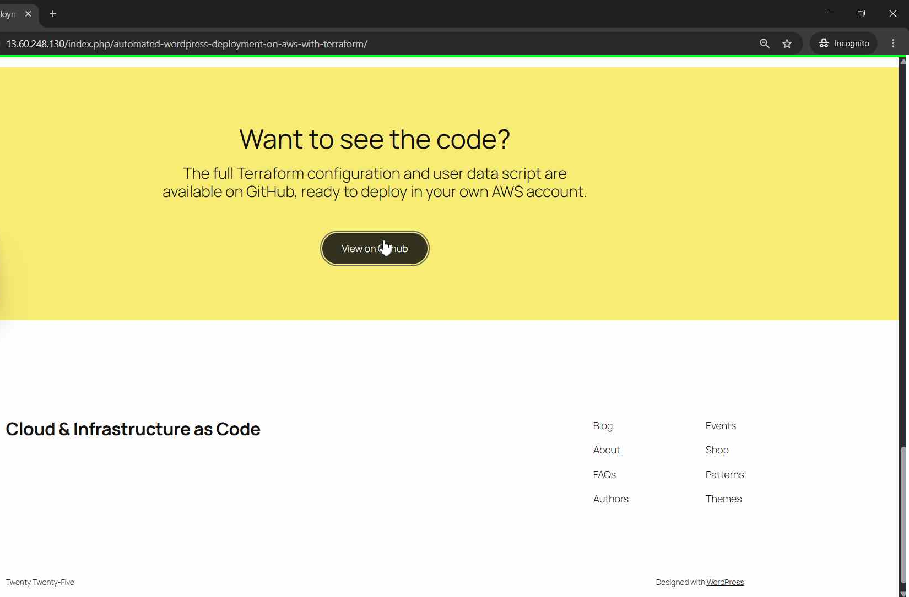

And the WordPress admin dashboard, fully working:

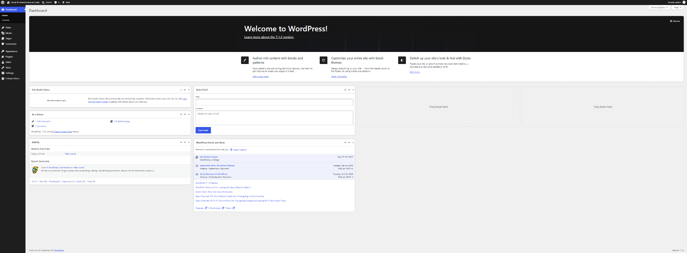

---

## What it builds

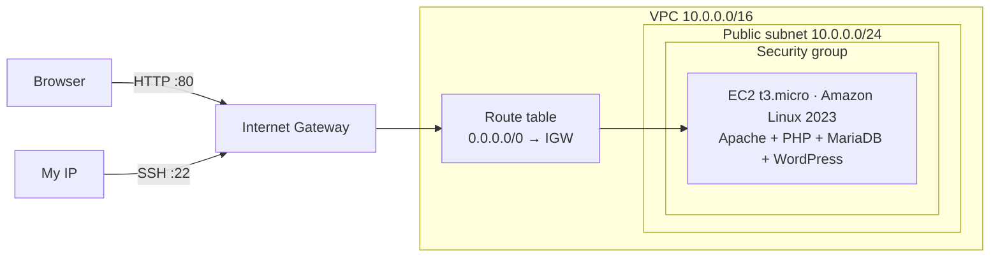

| Resource | Purpose |
|---|---|
| `aws_vpc` | Private network for the project (`10.0.0.0/16`) |
| `aws_subnet` | Public subnet where the web server lives (`10.0.0.0/24`) |
| `aws_internet_gateway` | Connects the VPC to the internet |
| `aws_default_route_table` | Sends all outbound traffic (`0.0.0.0/0`) to the internet gateway |
| `aws_security_group` + rules | Inbound HTTP/HTTPS from anywhere, SSH only from my IP. Outbound 80/443/22 |
| `aws_instance` | The web server. A bash user data script installs and configures everything on first boot |

## Project structure

```
Terraform_project/
├── main.tf               # provider, VPC, subnet, IGW, route table, calls the EC2 module
├── locals.tf             # CIDR blocks for the network
├── variable.tf           # inputs: my IP and database credentials
├── output.tf             # prints the web server's public IP
├── .gitignore            # keeps state files, tfvars and .terraform/ out of Git
└── EC2_mod/              # child module: everything about the web server
    ├── ec2.tf            # EC2 instance, security group and its rules
    ├── local.tf          # AMI, instance type, key pair name, user data template inputs
    ├── variable.tf       # module inputs (subnet, VPC, IP, DB settings)
    ├── output.tf         # exposes the instance's public IP to the root module
    └── User_data_script.sh   # bootstrap script (rendered with templatefile)
```

**How the pieces connect:**

- The **root module** builds the network and passes the subnet ID, VPC ID, my IP and the database credentials into `EC2_mod`.
- `EC2_mod` renders `User_data_script.sh` with `templatefile()`, so Terraform injects the DB name, user and passwords into the script before the EC2 instance receives it.
- The module's `webserver_ip` output is read in the root as `module.EC2_mod.webserver_ip` and printed after `apply`.
- `user_data_replace_on_change = true` makes Terraform rebuild the instance whenever the script changes, because user data only runs on the first boot.
- The database variables are marked `sensitive = true` in the module, so Terraform hides them in its output.

## What the user data script does

The script runs as root on first boot and is split into five phases:

1. **Install:** Apache (`httpd`), PHP and its MySQL extensions, MariaDB and `wget`. Then download and unpack the latest WordPress.
2. **Configure the database:** create a dedicated database and a user that can only connect from `localhost`, and grant that user all privileges on the WordPress database only.
3. **Configure WordPress:** copy `wp-config-sample.php` to `wp-config.php` and use `sed` to replace the placeholders with the real DB name, user and password.
4. **Configure Apache:** copy WordPress into `/var/www/html`, give ownership to `apache:apache`, set directories to `2775` and files to `0644`.
5. **Run:** enable and start `httpd` and `mariadb` so they also come back after a reboot.

`set -x` prints every command to the cloud-init log, which made debugging much easier.

## How to run it

**Requirements:** an AWS account, the AWS CLI configured (`aws configure`), Terraform, and an existing EC2 key pair named `wordpress_webserver_key` in `eu-north-1`.

1. Create `terraform.tfvars` in the project root (it's git-ignored):

   ```hcl
   IP_address             = "203.0.113.10/32"   # your public IP + /32 (curl ifconfig.me)
   Database_name          = "wordpress_db"
   Database_User_name     = "wp_user"
   Database_User_password = "a-strong-password"
   Databas_root_password  = "another-strong-password"
   ```

2. Deploy:

   ```bash
   terraform init
   terraform plan
   terraform apply
   ```

3. Open the IP from the `webserver_ip_adress` output in your browser. Wait a few minutes for the user data script to finish, then complete the WordPress install wizard.

4. Tear everything down when finished, so AWS doesn't charge you:

   ```bash
   terraform destroy
   ```

<p>
  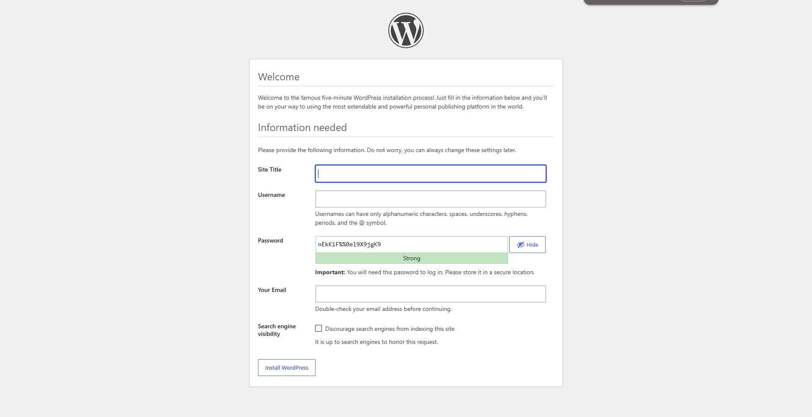
  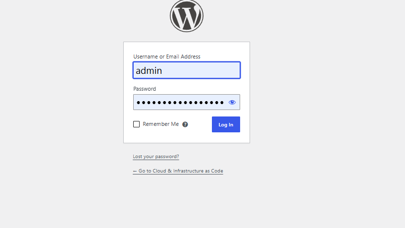
</p>

---

## Problems I hit and how I fixed them

### 1. Packages wouldn't download: the security group blocked HTTPS

The user data script never installed anything. When I SSH'd in and ran `dnf` by hand, every repository timed out.

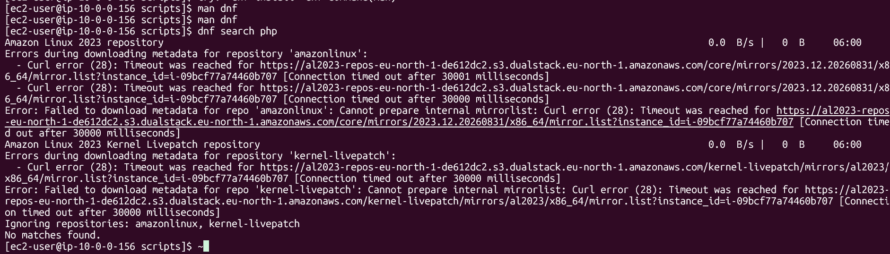

**Cause:** my security group only allowed outbound traffic on ports **80 and 22**. The Amazon Linux package repositories are served over **HTTPS (port 443)**, so every download was silently dropped.

**Fix:** added an outbound rule for port 443. The packages installed immediately.

**Lesson:** security groups block outbound traffic too. A "timeout" usually means a firewall rule, not a broken server.

### 2. `CREATE: command not found`: MySQL was running interactively

My database commands were valid SQL, but cloud-init reported every one of them as "command not found".

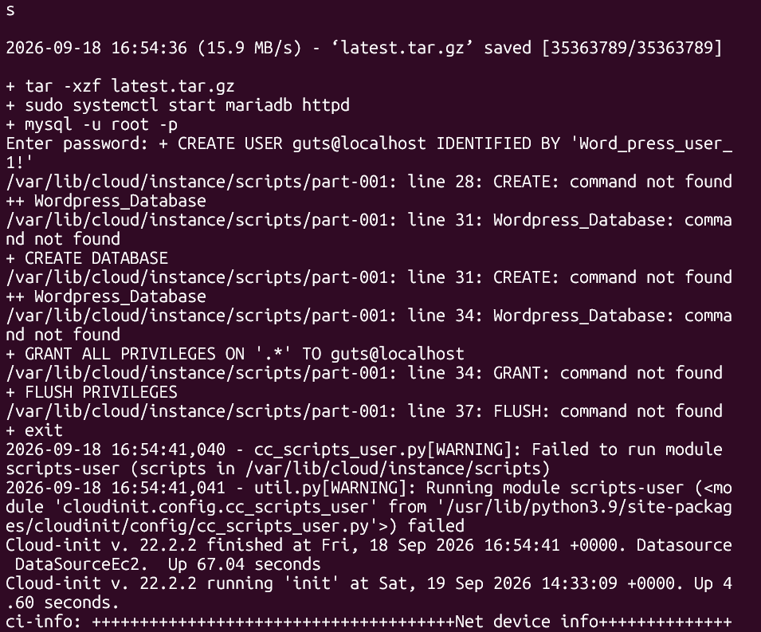

**Cause:** I started `mysql -u root -p` on one line and wrote the SQL on the following lines, the way you'd type it in a terminal.

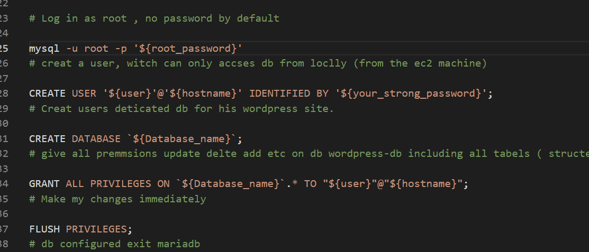

In a script, `mysql` started in **interactive mode** and waited for input that never came. When it exited, bash tried to run `CREATE`, `GRANT` and `FLUSH` as if they were bash commands.

**Fix:** run all the SQL in **one non-interactive command** with `mysql -e "..."`:

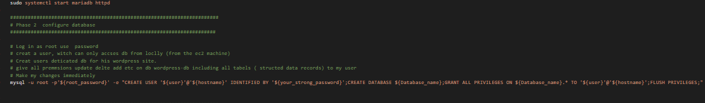

**Lessons:**
- A user data script has nobody to answer prompts. Every command has to be non-interactive.
- **Quoting matters:** the outer **double quotes** let bash expand my variables, and the inner **single quotes** pass the values to MariaDB as SQL strings.

### 3. "Error establishing a database connection": wp-config was never written

The database existed. I checked with `mysql` and my user and database were both there. But WordPress still couldn't connect.


**Cause:** my first version opened `wp-config.php` with `nano`, which is another interactive program, so the script got stuck. The lines after it, PHP `define(...)` statements, were then run by bash, which didn't understand them.

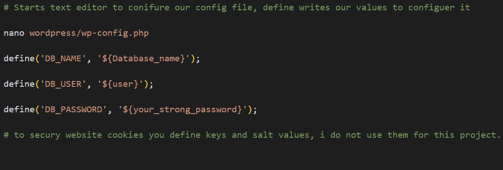

Next I tried `echo "..." > wp-config.php`. It ran, but it **overwrote the whole file**, and WordPress expects its settings in specific places in that file.

**Fix:** used `sed -i` to **find and replace** the placeholders (`database_name_here`, `username_here`, `password_here`) with the real values. It's non-interactive, and I don't need to know where in the file each setting is.

**Lesson:** to edit config files in automation, use stream editors like `sed`, not interactive editors.

### 4. Changing the script didn't change the server

**Cause:** user data only runs on an instance's **first boot**. Editing the script did nothing to the running server.

**Fix:** `user_data_replace_on_change = true`, so Terraform replaces the instance whenever the script changes. The side effect is that each rebuild gets a **new public IP**, which is why the IP is printed as an output.

### 5. `Reference to undeclared resource` when reading a module output

```hcl
value = EC2_mod.webserver_ip          # ❌ Terraform reads this as a resource
value = module.EC2_mod.webserver_ip   # ✅ module outputs need the module. prefix
```

**Lesson:** resources are `type.name`, variables are `var.name`, and module outputs are `module.<module>.<output>`.

### 6. Git: keeping secrets out and pushing over SSH

- **`.gitignore` typo:** I wrote `.terrafrom/**` instead of `.terraform/**`, so the provider folder wasn't ignored. `git check-ignore -v <file>` showed exactly which rule matched, or that none did.
- **`*.tfstate` didn't catch `terraform.tfstate.backup`**, because `*.tfstate` only matches names *ending* in `.tfstate`. The backup needed its own pattern.
- **`Permission denied (publickey)` on push:** my SSH key has a custom name (`gitid`), so SSH never tried it automatically, and no ssh-agent was running. I fixed it by starting the agent and adding the **private** key (`ssh-add ~/.ssh/gitid`, not the `.pub`).

---

## What I learnt

- **Infrastructure as Code end to end.** Terraform builds the network, the firewall and the server in the right order from code, and `terraform destroy` removes everything, so nothing is forgotten and left running.
- **Modules and outputs.** The root module builds the network, and the child module owns the web server. Values flow *in* through variables and *out* through outputs.
- **Networking fundamentals.** A subnet is only "public" when its route table sends `0.0.0.0/0` to an internet gateway. Security groups filter traffic **in both directions**.
- **Automation means non-interactive.** Anything that waits for input (`mysql -p`, `nano`, prompts) will hang or break in user data.
- **Debugging on the instance.** `set -x`, `/var/log/cloud-init-output.log` and running the commands by hand over SSH showed me where each failure happened.
- **Secrets and state.** I marked passwords `sensitive` and kept `terraform.tfvars` and `terraform.tfstate` out of Git, because state stores values in plain text.
- **Key pair choice.** I used an existing AWS key pair instead of generating one with Terraform's `tls_private_key`. That resource stores the private key unencrypted in the state file.

## Next improvements

- Set a MariaDB root password and remove the test database (equivalent to `mysql_secure_installation`).
- Generate WordPress security keys and salts in `wp-config.php` instead of leaving the defaults.
- Look up the AMI with a `data "aws_ami"` source instead of hard-coding an ID that only works in `eu-north-1`.
- Mark the database variables `sensitive` in the root module too, and fix the copy-pasted variable descriptions.
- Commit `.terraform.lock.hcl` so everyone uses the same provider version (my `*.hcl` ignore rule currently excludes it).
- Remove the outbound SSH rule, which the server doesn't need.
- Store state in a remote S3 backend so the project can be shared safely.
- Move the database to Amazon RDS and add HTTPS with a certificate.
